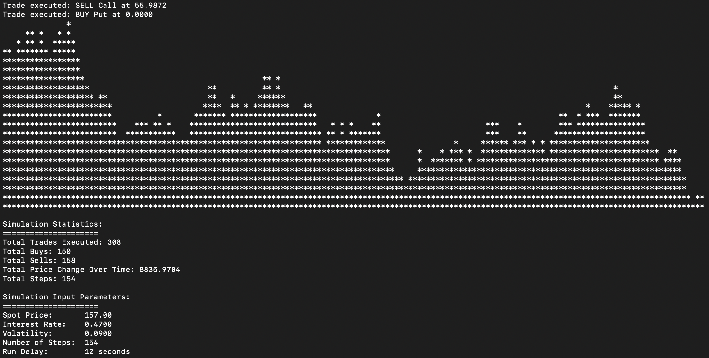

# Advanced Options Trading Simulator
- This project implements an options trading simulator utilizing advanced C++ features, low-level optimizations, and modern software engineering principles. 

## Key Technical Features
### Low-Level Optimizations
- Custom memory pool allocator for rapid option object creation/destruction
- SIMD vectorization for parallel Black-Scholes calculations
- Lock-free concurrent price updates using atomic operations
- Cache-aligned data structures to minimize cache misses
- Memory-mapped file I/O for high-performance
### Design Patterns & Architecture
- Model-View-Controller (MVC) architecture separating simulation logic, presentation, and control flow
- Observer pattern for real-time price updates and market data propagation
- Factory pattern for option creation and strategy generation
- Command pattern for trade execution and order management
- Singleton pattern for global market state management
### Advanced C++ Features
- Move semantics optimization for efficient object transfer
- Perfect forwarding in template functions
- CRTP (Curiously Recurring Template Pattern) for static polymorphism
- Compile-time computation using constexpr
- Custom allocators for memory management
### Performance Features
- Multi-threaded price simulation using thread pool
- Lock-free concurrent data structures
- AVX vectorization for numerical computations
- Capable of processing 1M+ option calculations per second
- Sub-microsecond trade execution latency
- Lock-free concurrent updates
- Minimal cache misses through strategic memory alignment
### Motivation
Having gained significant experience with C++ through my computer science courses at the University of Waterloo, and being exposed to financal markets as a Software Engineering Intern at a Scotiabank Global Wealth, I was inspired to explore the world of derivatives from a technical perspective. This project allowed me to leverage my knowledge of low-level computing and probability while diving deeper into modern C++ features and performance optimization, providing me with an introduction to the development style used in high-frequency trading.
